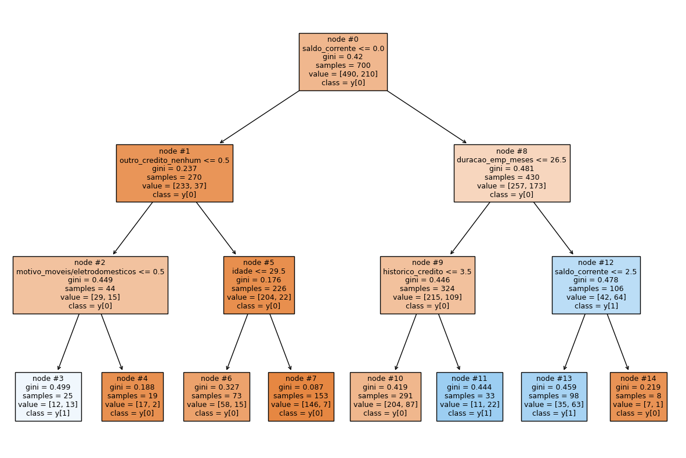
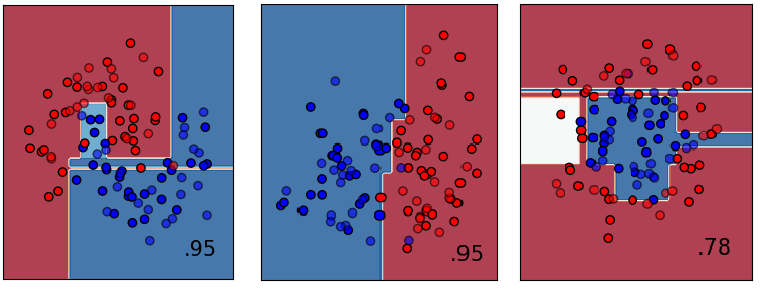
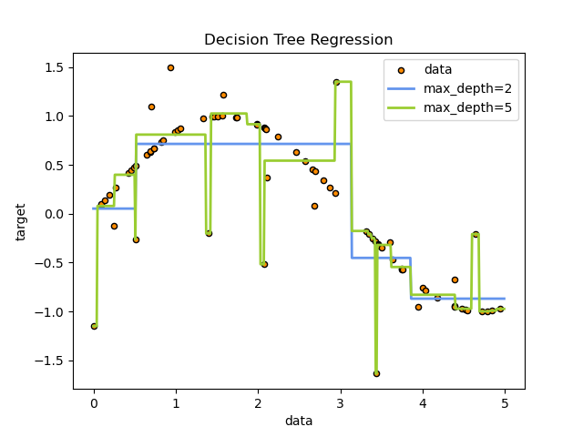
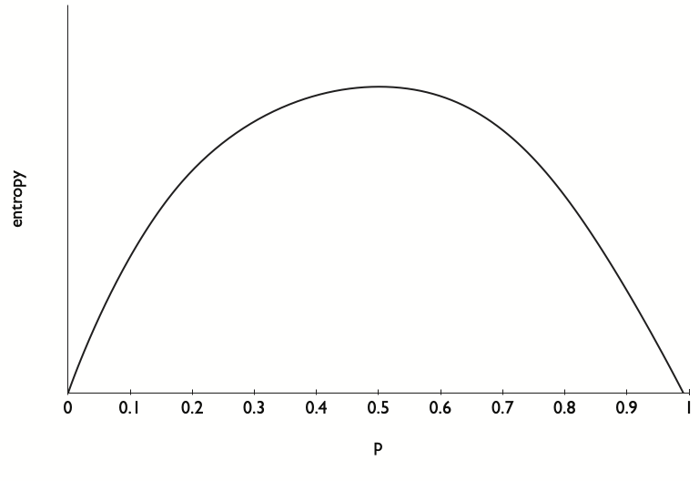

# Árvore de decisão

## Introdução

A Árvore de Decisão é uma técnica popular de aprendizado de máquina utilizada para predição e classificação de dados. Elas são estruturas de árvore hierárquicas que representam decisões e suas possíveis consequências, ajudando a visualizar e tomar decisões com base em múltiplas condições.

**Vantagens:**

* _Interpretabilidade_: as Árvores de Decisão podem ser facilmente visualizadas, facilitando sua interpretação. Por sua estrutura semelhante a um fluxograma, mesmo quando não são utilizadas como método principal de Machine Learning para determinado conjunto de dados, podem ser uma útil ferramenta na etapa de exploração desses dados. Veja abaixo um exemplo de visualização:



* _Preparação dos dados_: Árvores de decisão podem utilizar dados categóricos e numéricos (contínuos ou não) sem a necessidade de muitas transformações. Além disso, elas não precisam que os dados passem por processos de normalização, visto que as variáveis são tratadas de forma independente. Essa flexibilidade permite o seu uso tanto para classificação quanto para regressão.

* _Dados não lineares_: as Árvores de Decisão são capazes de representar algumas não linearidades nos dados, conforme o exemplo abaixo (obtido [aqui](https://scikit-learn.org/stable/auto_examples/classification/plot_classifier_comparison.html#sphx-glr-auto-examples-classification-plot-classifier-comparison-py)). Note que a divisão não linear é feita pela combinação de várias separações monovariadas linearmente.



* _Consumo computacional_: a Árvore de Decisão é um algoritmo simples computacionalmente de ser processado, consumindo, com isso, pouco CPU e não exigindo GPU. No entanto, ele pode acabar consumindo uma boa quantidade de memória dependendo do tamanho da árvore.


**Limitações:**

* _Tendência ao overfitting_: uma árvore complexa demais pode se ajustar de forma exagerada aos dados. Veja o exemplo abaixo em uma árvore utilizada para regressão (obtido [aqui](https://scikit-learn.org/stable/modules/tree.html)). Note que ao utilizar o `max_depth`maior a árvore se ajustou exageradamente a todos os outliers e deixou de representar a distribuição correta dos dados. Essa tendência também deixa a árvore suscetível a viéses nos dados, visto que pequenas mudanças ou desbalanceamentos nos dados podem alterar completamente a estrutura da árvore.



* _Dados lineares e convexos_: alguns tipos de dados serão mal representados por uma Árvore de Decisão, principalmente dados lineares que não possam ser representados por uma única feature (eles criarão uma árvore complexa para o representarem e correrão o risco de _overfitting_) e dados convexos, que as separações "ortogonais" da árvore não serão suficiente para capturar as variações.

## Explicações matemáticas

> No presente projeto, implementamos a árvore de decisão para classificação e focaremos as explicações matemáticas para este caso. Boa parte do que for explicado aqui, contudo, pode ser extrapolado para a regressão.

O principal desafio do algoritmo de Árvore de Decisão é decidir qual _feature_ é a mais adequada para dividir os dados e em qual valor ele deve ser dividido. Para isso, utilizamos os conceitos de _Entropia_ e _Ganho de Informação_.

### Entropia

Entropia é uma medida de incerteza ou desordem em um conjunto de dados. Quanto maior a entropia, maior a incerteza sobre a distribuição das classes nos dados. Pense em uma moeda jogada para cima. Ela tem 50% de chances de dar cara e 50% de chances de dar coroa. A entropia aqui é a maior possível, visto que a incerteza está em seu máximo. A relação da entropia com a probabilidade pode ser vista abaixo:




Na construção de uma árvore de decisão, o objetivo é reduzir essa incerteza ao máximo, organizando os dados de forma a separar as classes de maneira mais clara possível. A entropia é fundamental para determinar quais características (atributos) são mais informativos para dividir os dados de forma eficiente, contribuindo para a precisão das decisões feitas pela árvore.

A fórmula usada para calcular a entropia é chamada de _Fórmula de Shannon_:

$H(S) = -\sum_{i=1}^{c} p_i \log_2(p_i)$

Para cada classe $c$ no conjunto de dados, calculamos a proporção $p_i$ dessa classe no conjunto de dados $S$. Essa probabilidade é multiplicada pelo $log_2$ dela, que é uma medida de informação. Os resultantes desse cálculo por class são somados e o resultado, negativo, é a entropia. A razão pela qual a entropia é negativa está relacionada à interpretação da entropia como uma medida de desordem ou incerteza.

#### Entendendo $log_2(p_i)$

Nem sempre a interpretação de uma equação com $log_2$ é trivial. Vamos ver com um pouco mais de detalhe o $log_2$ e o motivo de ele ser utilizado.

Em matemática e computação, o logaritmo na base 2, denotado como $log_2$, é uma função que nos diz a potência à qual 2 deve ser elevado para produzir um determinado número. Ou seja, se $x = log_2(y)$, então $2^x = y$. Na fórmula da entropia de Shannon, $log_2(p_i)$ é o logaritmo na base 2 da probabilidade $p_i$.

Como a computação é baseada em sistemas binários (0 e 1), o logaritmo na base 2 é natural para medir quantidades relacionadas à eficiência de armazenamento e transmissão de informações. Comparado ao logaritmo em outras bases, como base 10 (logaritmo decimal) ou base natural (logaritmo natural), o logaritmo na base 2 oferece uma unidade de medida mais direta para a quantidade de informação transmitida ou armazenada em sistemas binários.

Isso significa que quando uma classe tem $p_i$ alto, ou seja, quando ela é dominante, o valor de $log_2(p_i)$ será próximo de zero, deixando toda a entropia baixa.

#### Fórmula da entropia normalzada

Algumas vezes a entropia pode variar signficativamente baseado na quantidade de categorias ou registros disponíveis. Uma alternativa para esses casos é normalizar utilizando o log natural ($ln$ ou $log_e$). Dessa forma, poderemos ter uma interpretação mais intuitiva de incerteza média por classe que leve em consideração o total de classes exstentes. Com isso, a fórmula fica:

$H(S) = -\frac{\sum_{i=1}^{c} p_i \log(p_i)}{\log(N)}$

Sendo aqui $N$ o número total de classes.

#### Gini

Um algoritmo um pouco mais simples é o Gini, que calcula a _impureza_, ou seja, dispersão dos dados com base na probabilidade de escolher dois itens aleatórios diferentes. A fórmula, bastante simples, é:

$Gini(S) = 1 -\sum_{i=1}^{c} p^2_i$

O índice Gini é computacionalmente mais eficiente, pois envolve apenas operações simples de multiplicação e soma, enquanto a entropia requer cálculos de logaritmos. Além disso, a entropia pode ser mais sensível a variações na distribuição das classes nos dados, fazendo com que o Gini tenha uma maior estabilidade. Esse índice é o _default_ na biblioteca Scikit-learn.

### Ganho de informação

O ganho de informação é a diferença entre a entropia inicial ($H(S)$) e a soma das entropias de uma divisão realizada nos dados, balanceados pela quantidade de _rows_. O objetivo é conseguir saber o ganho que tal divisão nos dados trará na redução da entropia, que é o objetivo da Árvore de Decisão. A fórmula é:

$InformationGain(S) = H(S) - [(H(S_{left}) * n_{left}/n) + (H(S_{right}) * n_{right}/n)]$

> Existem formas de representar essa fórmula melhor, mas essa fica o mais próximo do que efetivamente está implementado no código do projeto.

## Implementação

O objetivo do algoritmo é, portanto, encontrar, para cada conjunto de dados, o atributo e seu respectivo valor que, separando o conjunto por eles, tenha o maior ganho de informação. Para tal, utilizamos uma **Busca Gulosa**. Ela é definida por buscar a melhor solução _local_ para um problema. Ou seja, no caso da Árvore de Decisão, buscamos a melhor divisão possível (com maior ganho de informação) _sem considerar decisões futuras_, mas apenas o melhor valor que pode ser obtido naquele momento.

A abordagem gulosa é eficiente em termos computacionais porque cada divisão é feita considerando apenas os critérios locais de impureza, sem necessidade de avaliar todas as combinações possíveis de divisões em toda a árvore.

Essa abordagem pode ser feita de forma recursiva, como abaixo:

1. Cria o nodo raiz
2. Para cada atributo, escolhe o valor com maior ganho de informação. Atributos categóricos são divididos entre os iguais e os diferentes do valor escolhido, enquanto os atributos numéricos são divididos entre os maiores e menores do que o valor escolhido.
3. Escolhe-se o atributo que teve o melhor ganho de informação.
4. Realizamos a divisão dos dados de acordo com o melhor _split_ escolhido e, para cada uma das divisões, voltamos para o passo **2**. Paramos apenas se a entropia de um dos nodos resultantes for zero, o número de registros for menor que o mínimo definido ou a profundidade for maior que a definida.

A implementação em python é expressa como:

```python
def __fit_node__(self, node, depth: int = 1):
        best_split = self.__find_best_feature__(node.X, node.y)
        if best_split.information_gain > 0:
            node.add_children(best_split, self.min_size)
            if (depth + 1) <= self.max_depth:
                if node.left:
                    self.__fit_node__(node.left, (depth + 1))
                if node.right:
                    self.__fit_node__(node.right, (depth + 1))

    def fit(self, X: np.array, y: np.array):
        self.__validate__(X, y)
        root = DecisionTreeClassifierNode(X, y)
        self.__fit_node__(root)
        self.root = root
        return self
```

Onde o método `__find_best_feature__` realiza os cálculos de entropia e ganhos de informação para cada valor de cada atributo (busca gulosa) procurando o melhor.

> Mais sobre a implementação veja o código fonte associado no projeto.

Para realizar a predição com novos registros, basta navegar pela árvore criada. Quando alcançar uma folha, ou seja, um nodo sem subsequentes, o valor predito para o registro é o valor mais frequente daquele nodo. 

A predição pode ser expressa:

```python
def __predict_single(self, x: np.array, node):
        if node.left is None and node.right is None:
            return node.vote()

        if node.split_function(x[node.splited_feature_index]):
            if node.left is None:
                return node.vote()
            return self.__predict_single(x, node.left)
        else:
            if node.right is None:
                return node.vote()
            return self.__predict_single(x, node.right)

    def predict(self, X: np.array):
        predictions = [self.__predict_single(x, self.root) for x in X]
        return np.array(predictions)
```

> Lembrando que todas as implementações realizadas aqui seguem o objetivo principal do projeto: **facilitar a didática e a leitura do código**. Com isso, funções complexas de otimização ou alterações no código buscando a melhor performance na linguagem não foram realizadas. Para uma implementação mais complexa e a variação dela para regressão, veja a biblioteca Scikit-learn.

## Para saber mais

Alguns tópicos não foram implementados aqui e podem ser explorados em melhorias futuras ou para quem quiser pesquisar mais:

* _Prune_ ou "podagem", como o nome diz, é a remoção de partes da árvore que não contribuem significativamente para a precisão.
* _Ajuste fino dos parâmetros_, ou seja, criar mais parâmetros de controle, como um valor mínimo de diminuição da entropia para que um novo nó seja criado.
* Melhorar e normalizar o algoritmo de ganho de informação (Gain Ratio).
* Implementar `feature_importance`.
* Implementar visualização da árvore.
* Criar os testes unitáros.